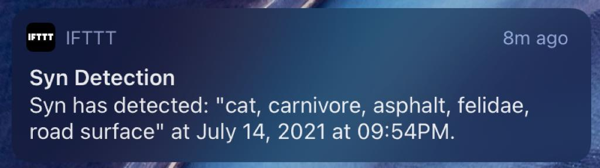

# syn
Visual monitoring using the Raspberry Pi, Google Cloud and React Native.



## Raspberry Pi Components
The project requires the following components for the Raspberry Pi:
- **Raspberry Pi & Camera**
- **Zero View camera mount**: https://thepihut.com/products/zeroview
- **Raspberry Pi Zero Camera Adapter**: https://thepihut.com/products/raspberry-pi-zero-camera-adapter

### Setup
These steps are required to get started with the project:
- Install Raspberry Pi OS on the Raspberry Pi. See https://www.raspberrypi.org/software/operating-systems/
- For local development purposes, the default `ssh` username and password can be left as they are
- Enable the Raspberry Pi Camera by changing the correct settings after running `sudo raspi-config`

### Motion 
Motion is a highly configurable program that monitors video signals from many types of cameras. I have made the following changes to the included `motion.conf` file (compared to the default configuration):

- Enable and set `target_dir` to `/home/pi/syn`
- Set `width` to `640` and `height` to `480`
- Set `locate_motion_mode` to `preview`
- Set `locate_motion_style` to `redbox`
- Set `event_gap` to `10`
- Set `output_pictures` to `center`

#### Uploading to the Storage Bucket
Motion is configured to upload capture images to the Storage Bucket. The name of the bucket is set programmatically by Terraform by using the `templatefile` function.

## Infrastructure
The `terraform` directory contains all of the infrastructure configuration required by the project.
Make sure you already have a Google Cloud organization and billing account before going forward.

Notice: since I am not using a service account to run Terraform, these steps need to done manually:

- Create billing budget and notifications
- Enable Firebase API

### Configure the gcloud SDK
Setup the gcloud tool in order to easily deploy changes to the infrastructure.
- Create and switch to a new `gcloud` configuration: `gcloud config configurations create syn`
- Authenticate with `gcloud auth login`
- Get application default credentials with `gcloud auth application-default login`
- Set the project name with `gcloud config set project <your-prefix>-syn` (replace `<your-prefix>`)

### Terraform
Terraform is configured to use a Google Cloud Storage bucket for saving state. Furthermore, the `owner` role is given to the organization admin for simplicity. Using a `terraform` service account would be a better practice

The `terraform/raspberrypi.tf` configuration, via SSH:
- Installs `motion` and `gcloud` on the Raspberry Pi
- Sets the correct permissions for directories used by `motion`
- Creates service account keys and copies them to the Raspberry Pi
- Further information on the service account and IAM roles can be found in `iam.tf` and `storage.tf`

The contents of `backend.tf` need to be commented out until the state bucket is created. Also, the Google Cloud project needs to be setup before everything else. Therefore, during the first run, this is the command to run:

```shell
terraform plan -target=module.project -out=syn.plan
terraform apply syn.plan
```

Notice: the Google Cloud Functions source code in Google Cloud Source Repository must be present before deploying a function. 

### Functions
Terraform creates a new repository on Google Cloud Source Repositories where to host the Google Cloud Functions. Afterwards:
- Configure a new git remote: `gcloud init && git config --global credential.https://source.developers.google.com.helper gcloud.sh`
- Add the remote to this repository: `git remote add google https://source.developers.google.com/p/<your-project>/r/syn`. Replace `<your-project>` with the correct name.
- Push changes with `git push --all google`

### App
Syn uses a React Native application as frontend. The application works on all platforms, browsers included, and it uses:
- Typescript
- `expo` for React Native development
- `native-base` as UI library
- `firebase` to provide backend functionality
- `redux` because I wanted to test it after many years I haven't touched it

## IFTTT
The project currently sends detection notifications to the IFTTT app via IFTTT webhooks. The webhook URL can be configured via Terraform and it looks like this: `https://maker.ifttt.com/trigger/<event-name>/with/key/<key>`. Replace `<event-name>` and `<key>` with your information.

## Makefile
The Makefile contains the following commands to make development easier:
- `make ssh`: Easily connect over SSH to the Raspberry Pi

## Costs
The project keep costs low in a number of ways:
- Images are only uploaded to the bucket when a movement is detected
- Images that do not contain the desired labels (see `ALLOWED_LABELS` env in Terraform) are deleted
- Billing budgets and alerts are set manually
- I have been looking for a way to limit requests to the Vision API outside the free-tier limit, but I don't have a good way to do it yet.

## TODO
- Describe data flow
- Idea: Let motion trigger a custom app that uses Core IoT?
- Firebase documentation
- Add firebase authentication
- Mirror github repo
- Setup functions for local development and automated deployment
- Create pipelines